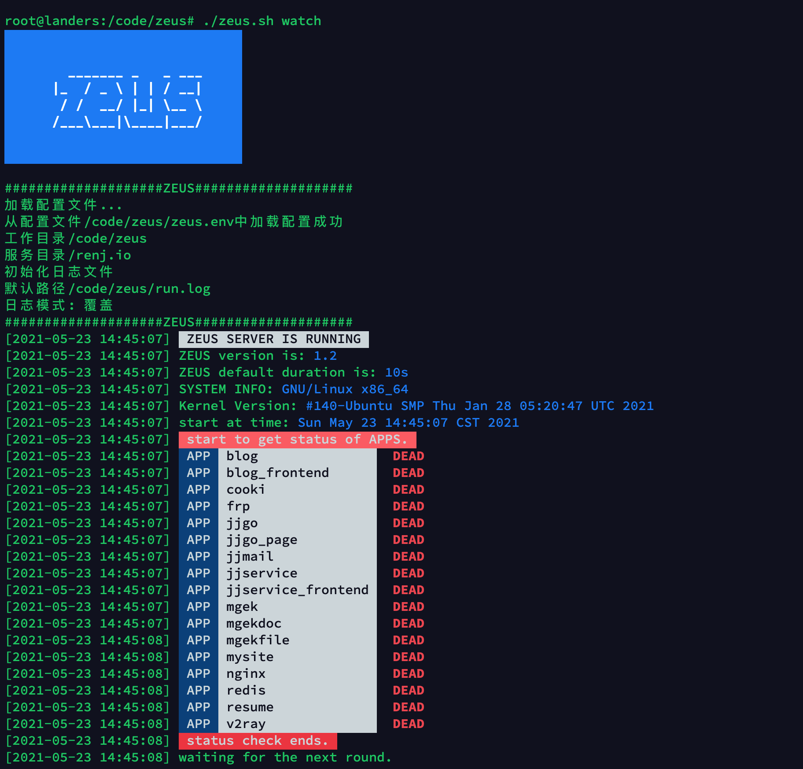
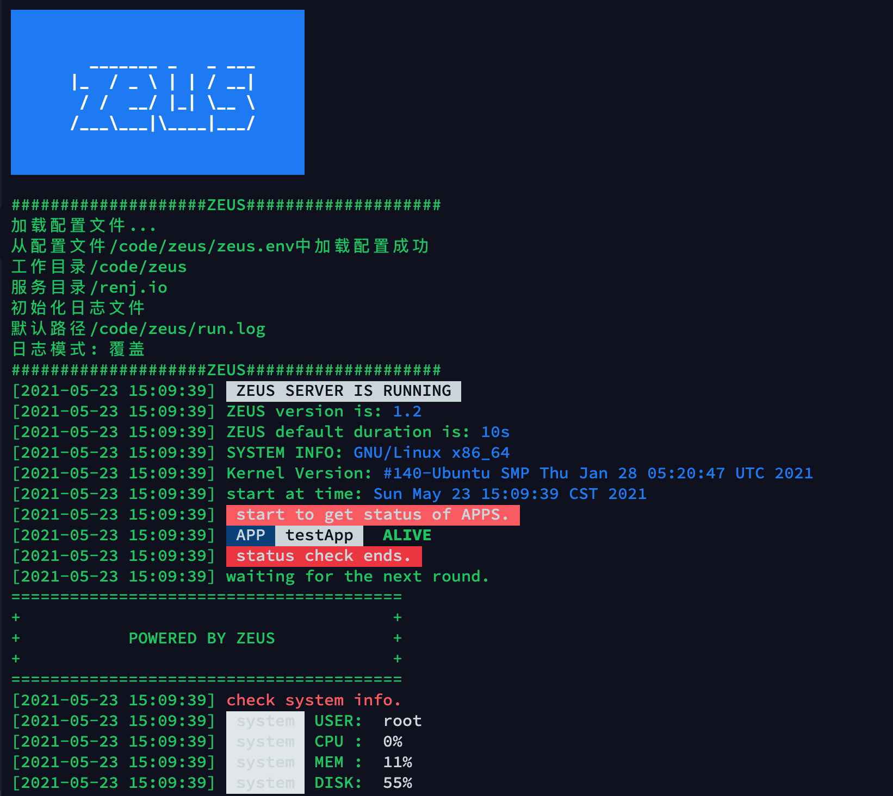

# zeus
zeus is a linux app manager

参考systemctl设计编写的shell程序

## 功能

- 注册管理服务
- 可定制的服务管理脚本cmds
- 基于用户环境变量运行
- 支持实时监控
- 支持日志自动分割
- 支持控制台高亮输出

### 注册环境变量函数

每次启动zeus都会加载zeus.env文件来加载里面的环境变量

后续的脚本可以共用此变量组

```bash
# env 文件
# 版本号
ZEUS_VERSION 1.2
# 是否使用systemd管理服务
ZEUS_USE_SYSTEMD 1
# watch dog是否动态刷新
ZEUS_WATCH_DOG 0
# zeus的日志路径为空时不保存日志
ZEUS_LOG_PATH zeus.log
# 是否打印输出日志到终端
ZEUS_LOG_ECHO 1
# 是否每次覆盖运行日志
ZEUS_LOG_COVER 1
# 定时日志分割(单位s) 0 表示不分割
ZEUS_LOG_ROTATE 3600
# server的默认定时
ZEUS_DURATION 10
# 服务目录
ZEUS_SERVICE_ROOT /renj.io
# 应用目录
ZEUS_APP_ROOT /renj.io/apps
# 应用日志目录
ZEUS_APP_LOG /renj.io/log
# nginx路径
ZEUS_NGINX_ROOT /usr/local/nginx
# nginx配置文件目录
ZEUS_NGINX_CONF /usr/local/nginx/conf.d
# redis路径
ZEUS_REDIS_ROOT /usr/local/redis/bin
```

所有的环境变量会在每次启动zeus服务时自动加载进入全局shell环境

## 服务结构

```bash
root@landers:/code/zeus# tree -L 1
.
├── demo.png
├── function
├── LICENSE
├── log
├── README.md
├── register
├── service
├── zeus.env
└── zeus.sh
```

`zeus.sh`为zeus的主程序

`zeus.env`为用户定制的环境变量

`function` 为zeus的功能函数目录

`register`为服务的注册模板

`service`为注册在zeus的服务群组

## 模板

zeus使用模板方便的管理服务注册所需的文件

**cmds**

``` bash
start.sh
stop.sh
restart.sh
status.sh
clear.sh
env.sh
```

cmds模板文件定义了在注册服务时，默认会创建的文件

**template**

```bash
{
  "zeus_app_name": "",
  "zeus_app_version": "",
  "zeus_app_des": "",
  "zeus_app_path": "",
  "zeus_app_type": "",
  "zeus_control": {
    "start": [],
    "stop": [],
    "restart": [],
    "status": [],
    "clear": [],
    "update": [],
    "backup": [],
    "install": [],
    "uninstall": []
  }
}
```

## 使用帮助

```bash
root@landers:/code/zeus# ./zeus.sh help

zeus使用帮助
(zeus是一个服务注册监听管理程序 帮助你管理服务注册模板)
使用方式：zeus [cmd] [app]
支持命令:
help     显示帮助信息
config   显示配置环境变量
register 注册程序为服务
delete   卸载服务
manage   管理注册在zeus的服务
show     显示注册在zeus的服务
template 显示注册服务模板
edit     编辑模板和环境变量

快捷命令：
watch    监听服务
config   查看配置
start    启动服务
stop     停止服务
status   查看状态
restart  重启服务
show     查看服务
log      查看日志
update   更新服务
rm       删除服务
rmlog    清除日志
backup   备份服务
export   导出服务配置
```

## 快速开始

### 注册一个服务

```bash
root@landers:/code/zeus# ./zeus.sh reg testApp
开始注册服务testApp
开始初始化服务testApp
服务目录创建完毕/code/zeus/service/testApp
开始创建服务脚本
create cmd start.sh done...
create cmd stop.sh done...
create cmd restart.sh done...
create cmd status.sh done...
create cmd clear.sh done...
create cmd env.sh done...
开始脚本提权
开始创建默认版本文件
开始创建默认服务描述文件
服务testApp创建完毕
```


### 开始监听

```bash
zeus watch
```



### 监听指定服务

```bash
zeus watch testApp
```



### 查看配置变量

```bash
zeus config

root@landers:/code/zeus# ./zeus.sh config
ZEUS_VERSION=1.2
ZEUS_USE_SYSTEMD=1
ZEUS_WATCH_DOG=0
ZEUS_LOG_PATH=zeus.log
ZEUS_LOG_ECHO=1
ZEUS_LOG_COVER=1
ZEUS_LOG_ROTATE=3600
ZEUS_DURATION=10
ZEUS_SERVICE_ROOT=/renj.io
ZEUS_APP_ROOT=/renj.io/apps
ZEUS_APP_LOG=/renj.io/log
ZEUS_NGINX_ROOT=/usr/local/nginx
ZEUS_NGINX_CONF=/usr/local/nginx/conf.d
ZEUS_REDIS_ROOT=/usr/local/redis/bin
```

## 全局使用zeus

你可以把zeus注册为一个全局的命令，然后在任何地方输入`zeus`即可使用

修改zeus.sh

```bash
#!/usr/bin/env bash
# zeus app
# zeus负责注册所有的服务为linux服务 并且监控这些服务
# 所有服务的运行脚本放置在service目录下
# register负责放置注册服务的模板

# 首先必须保证应用目录存在
# 程序运行的目录在最开始注册 所有shell共享此变量

# 在任意目录使用zeus时需要下指定zeus_root即zeus的运行时目录
USR_ADD_ZEUS_ROOT=/renj.io/zeus
...
```

设置`USR_ADD_ZEUS_ROOT`变量为zeus所在的绝对路径

设置后每次启动zeus就会重定向至此路径下运行

当`USR_ADD_ZEUS_ROOT`不存在时，zeus会使用`$(pwd)`作为运行目录